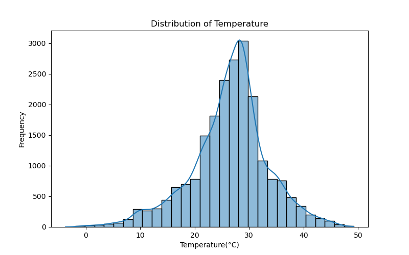
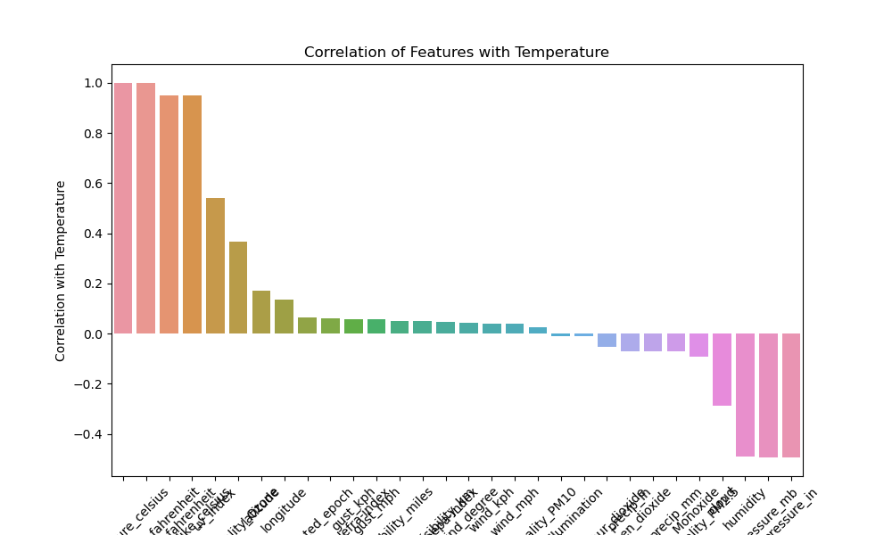
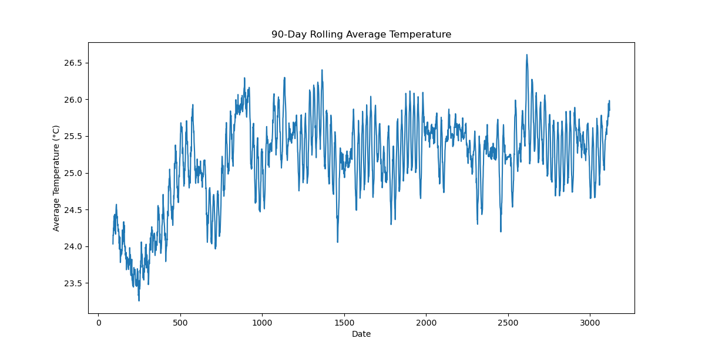
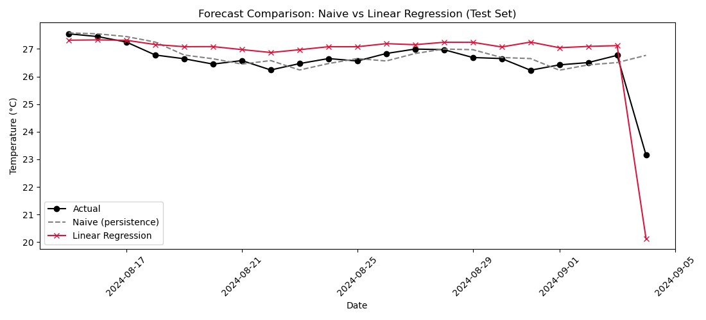
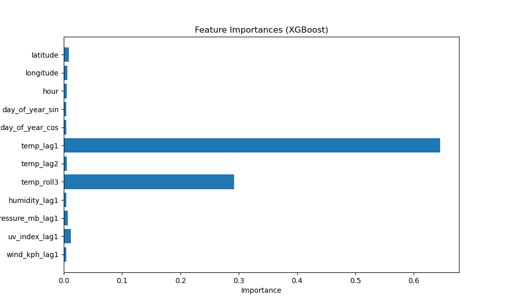

# Weather Trend Forecasting

## Project Overview

This project focuses on building a machine learning model to predict weather-related outcomes using historical weather data. The aim is to explore patterns in weather variables and develop a predictive model that can support data-driven weather analysis.

The project involves data cleaning, exploratory data analysis, feature engineering, model development, evaluation, and hyperparameter tuning.

---

## Dataset

The dataset used in this project is the *Global Weather Repository* dataset, which contains daily weather observations from different locations worldwide.

The dataset includes features such as:

- Temperature
- Humidity
- Wind speed
- Atmospheric pressure
- Precipitation
- Cloud cover
- Weather conditions
- Location information

---

## Objectives

The main objectives of this project are:

- Perform exploratory data analysis to understand weather patterns.
- Clean and preprocess weather data for modelling.
- Identify important features influencing predictions.
- Train machine learning models for prediction.
- Evaluate and optimize model performance.

---

## Technologies Used

### Programming Language
- Python

### Libraries
- Pandas
- NumPy
- Matplotlib
- Seaborn
- Scikit-learn

### Machine Learning Techniques
- Regression/Classification models
- Time series validation
- Hyperparameter tuning
- Model evaluation

---

## Project Workflow

### 1. Data Cleaning
- Handled missing values.
- Converted data types where necessary.
- Prepared features for modelling.

### 2. Exploratory Data Analysis
Performed analysis using:
- Distribution plots
- Correlation analysis
- Trend visualization
- Feature relationships

### 3. Feature Engineering
Created relevant features to improve model performance and capture patterns in weather data.

### 4. Model Development
Several machine learning models were trained and compared.

### 5. Model Optimization
Used time-series cross-validation and hyperparameter tuning to improve model performance.

---

## Model Evaluation

Models were evaluated using appropriate performance metrics.

The best-performing model was selected based on its ability to generalize well on unseen data.

---

## Key Findings

- Weather variables show strong relationships that influence prediction outcomes.
- Machine learning models can capture patterns in historical weather data.
- Model tuning improved predictive performance.

---

## Recommendations

- Incorporate additional historical weather data to improve predictions.
- Continuously retrain the model with new observations.
- Deploy the model as an interactive forecasting tool for practical use.

---
## To access the notebook;

To run this project locally:

1. Clone the repository:

git clone https://github.com/rita-nyaga/PMA_project.git

2. Navigate to the project folder:

cd weather-forecasting-project

3. Install dependencies:

pip install -r requirements.txt

4. Launch Jupyter Notebook and open the notebook file:

jupyter notebook

Run the notebook cells to reproduce the analysis and results.

## Author

*Rita Nkirote Nyaga*

Data Science | Machine Learning | Data Analytics

GitHub:\(https://github.com/rita-nyaga)